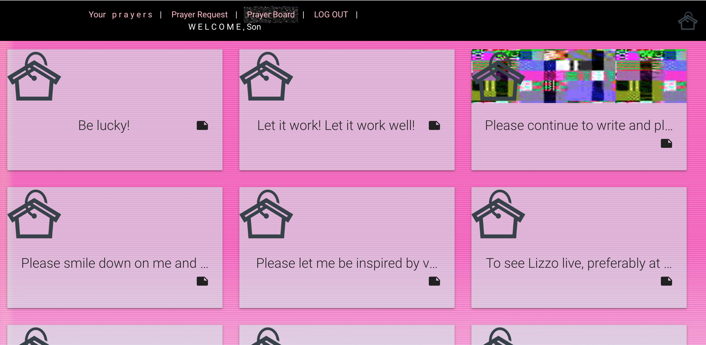

# Prayers Gonna Pray

  
You can pray for anything. To anyone. You can see prayers all over the world. 

### Technologies Used

  
Prayers Gonna Pray is built with mongoDB, Express, React, and Node. 
  
Materialize CSS library is used for styling as well as the react-materialize npm module. 
  
The Google geolocation API is used to fetch user locations. 
A publicly available Google Maps key was used for the maps. 
  
JSON webtokens are used for authorization. 

### Getting Started

This [Trello Board](https://trello.com/b/ftzzpf8q/prayers-gonna-pray) was used to plan and track my progress. 
  
Check out the app at <https://prayersgonnapray.herokuapp.com/>

### Unsolved Problems
- A "real" Google Maps API key requires a payment so at the moment the map says *For Development Purposes Only* all over it.
- There is no email verification system and users cannot delete their accounts yet. 
- There still seem to be some bugs that occasionally pop up with API calls. The userdashboard can be particularly slow to load. This could be improved. 

### Future Enhancements
- The map markers will be clickable so a user can view the prayers made in that location
- Socially polling so users can vote for the side of good or the side of bad. 
- FAQ, About, and Terms of Use pages. 

## Learn More
You can visit me at <https://www.linkedin.com/in/anna-elizabeth-peterson/> 

# prayersgonnapray

